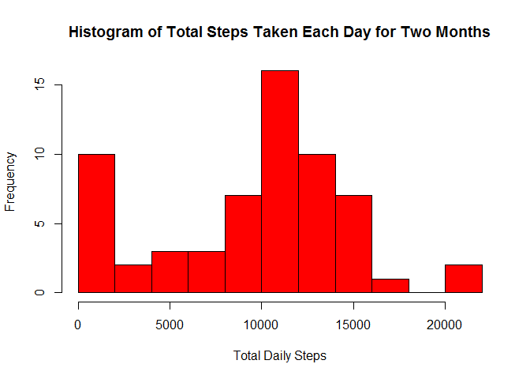
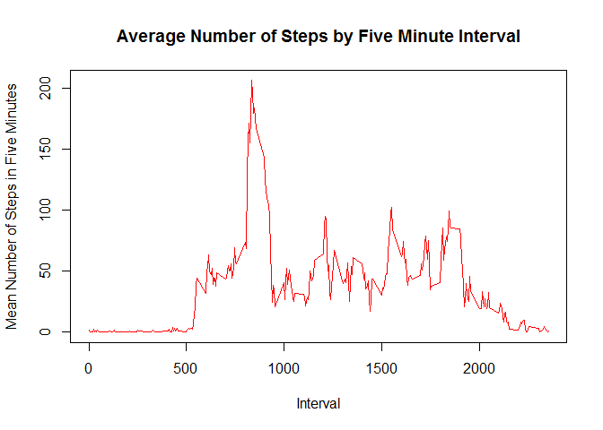
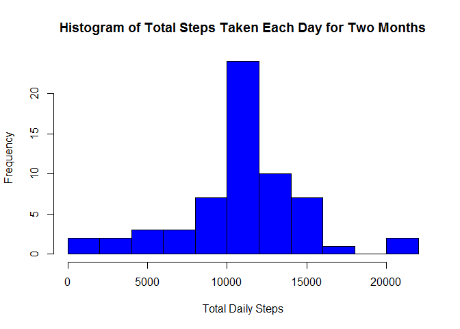
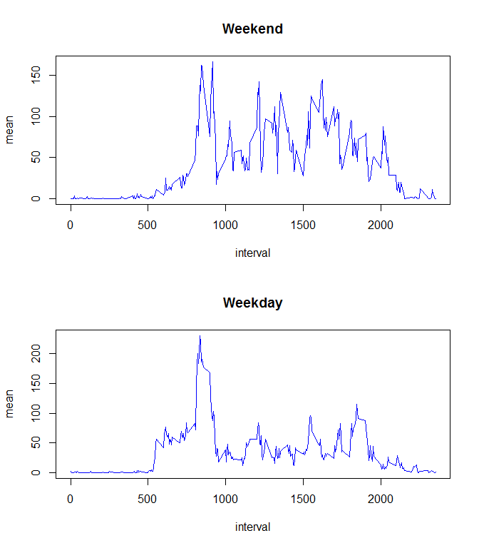

# Reproducible Research: Peer Assessment 1
Laura Moon  


## Loading and preprocessing the data
As a preliminary matter, we fork the assignment repository to our own Github account, and then clone it to the desired local folder. Then, in R, we set the working directory to that folder:

```r
setwd("~/Coursera/Reproducible-Research/Project1/RepData_PeerAssessment1")
```

The data are in a zip file, so we first unzip it:

```r
unzip("activity.zip")
```
Next we read the dataset into R:

```r
activity <- read.csv("activity.csv")
```
Exploring the dataset a bit, we see that the date column has been imported as a factor:


```r
str(activity)
```

```
## 'data.frame':	17568 obs. of  3 variables:
##  $ steps   : int  NA NA NA NA NA NA NA NA NA NA ...
##  $ date    : Factor w/ 61 levels "2012-10-01","2012-10-02",..: 1 1 1 1 1 1 1 1 1 1 ...
##  $ interval: int  0 5 10 15 20 25 30 35 40 45 ...
```
Because the dates are in a standard format, we can simply convert the column to dates format, which will simplify our weekday versus weekend analysis later.

```r
activity$date <- as.Date(activity$date)
```
In addition, it appears that the interval values are not the number of minutes past midnight (as I initially assumed), but the time on a 24-hour clock written without a colon. Here are the first 40 values:

```r
activity$interval[1:40]
```

```
##  [1]   0   5  10  15  20  25  30  35  40  45  50  55 100 105 110 115 120
## [18] 125 130 135 140 145 150 155 200 205 210 215 220 225 230 235 240 245
## [35] 250 255 300 305 310 315
```
So the values skip from 55 to 100, 155 to 200, etc. This does not affect the calculations, but it does affect the appearance of the line graphs, which plot a larger space between 55 and 100 than between 50 and 55 or 100 and 105 even though the time difference is the same. 

Because the sample graph provided with this assignment ignores this issue, I have not done anything about it, but any future work with this dataset should account for this data format.

## What is mean total number of steps taken per day?
First we calculate the total number of steps per day, ignoring missing values:

```r
require(dplyr)
```

```
## Loading required package: dplyr
```

```
## 
## Attaching package: 'dplyr'
```

```
## The following objects are masked from 'package:stats':
## 
##     filter, lag
```

```
## The following objects are masked from 'package:base':
## 
##     intersect, setdiff, setequal, union
```

```r
dailytotals <- summarize(group_by(activity, date), steps=sum(steps, na.rm = TRUE))
```
We see the distribution in this histogram:

```r
hist(dailytotals$steps, breaks = 10, col = "red", xlab = "Total Daily Steps", main = "Histogram of Total Steps Taken Each Day for Two Months")
```

<!-- -->

Finally, we calculate the mean and median of the total number of steps taken each day:

```r
c(mean=mean(dailytotals$steps), median=median(dailytotals$steps))
```

```
##     mean   median 
##  9354.23 10395.00
```

## What is the average daily activity pattern?
To see the average daily activity pattern, we average the number of steps in each 5-minute interval across all 61 days.

```r
intervalmean <- summarize(group_by(activity, interval), mean=mean(steps, na.rm = TRUE))
```
Then we plot the average value across a day:

```r
plot(intervalmean$interval, intervalmean$mean, type = "l", col="red", xlab = "Interval", ylab = "Mean Number of Steps in Five Minutes", main = "Average Number of Steps by Five Minute Interval")
```

<!-- -->

Finally, we find the interval with the most activity on average:

```r
maxmeansteps <- max(intervalmean$mean)
maxinterval <- intervalmean$interval[intervalmean$mean==maxmeansteps]
c(interval = maxinterval, steps = maxmeansteps)
```

```
## interval    steps 
## 835.0000 206.1698
```
Given the analysis of the interval data at the end of the first section, we can see that this maximum activity occurs from 8:35 to 8:40 in the morning.

## Imputing missing values
There are many missing values in this dataset.

```r
missing <- sum(is.na(activity$steps))
missing
```

```
## [1] 2304
```
More precisely, there are 2304 missing values.

As seen in the previous section, the number of steps varies considerably depending on the time of day. Therefore, a simple and sensible method for imputing missing values is to replace the "NA" with the mean for that interval.

We create a vector of the interval means for the entire dataset and a logical vector of the missing values and multiply them to create a vector containing only the replacement values for the NA's:

```r
longintmean <- rep(intervalmean$mean,61)
missinglogical <- is.na(activity$steps)
missingvals <- longintmean*missinglogical
```
Then we create a copy of the original dataset and replace the NA's with zeros. 

```r
activity2 <- activity
activity2$steps[is.na(activity2$steps)] <- 0
```
Finally, we add the replacement values to the dataset:

```r
activity2$steps <- activity2$steps + missingvals
```
Now we can repeat the analysis of total daily steps on the new dataset, starting with the histogram of daily totals:

```r
dailytotals2 <- summarize(group_by(activity2, date), steps=sum(steps))
hist(dailytotals2$steps, breaks = 10, col = "blue", xlab = "Total Daily Steps", main = "Histogram of Total Steps Taken Each Day for Two Months")
```

<!-- -->

Unlike the initial histogram, there is no longer a spike of low-activity days.

We conclude this section with the mean and median totals:

```r
c(mean=mean(dailytotals2$steps), median=median(dailytotals2$steps))
```

```
##     mean   median 
## 10766.19 10766.19
```
Not surprisingly, the mean and median totals are higher with the missing values replaced by an estimate. They are also the same, reflecting the use of the mean interval values to replace the missing values. This approach made the median value for each interval the same as the mean value such that the mean and median daily totals are also the same.

## Are there differences in activity patterns between weekdays and weekends?
We add a column to the data set with the missing values filled in indicating whether the day is a weekday or weekend, naming the column week. We first identify every day as a weekday, and then change Saturdays and Sundays to weekends. Finally, we coerce the column to a factor variable.

```r
activity2$week <- rep("weekday", length(activity2$steps))
activity2$week[weekdays(activity2$date)=="Saturday"] <- "weekend"
activity2$week[weekdays(activity2$date)=="Sunday"] <- "weekend"
activity2$week <- as.factor(activity2$week)
```
To compare weekday activity to weekend activity, we need to calculate the average number of steps for each 5-minute interval as we did above, but this time we also group the data by the week column.

```r
intervalmean2 <- summarize(group_by(activity2, interval, week), mean=mean(steps))
```
To complete this analysis, we plot the average daily activity as average steps per 5-minute interval separated into weekend and weekday activity:

```r
par(mfrow=c(2,1))
with(subset(intervalmean2, week=="weekend"), plot(interval,mean, type = "l", col="blue", main = "Weekend"))
with(subset(intervalmean2, week=="weekday"), plot(interval,mean, type="l", col="blue", main = "Weekday"))
```

<!-- -->
